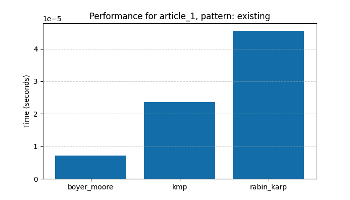
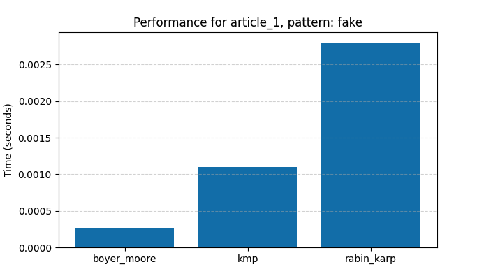
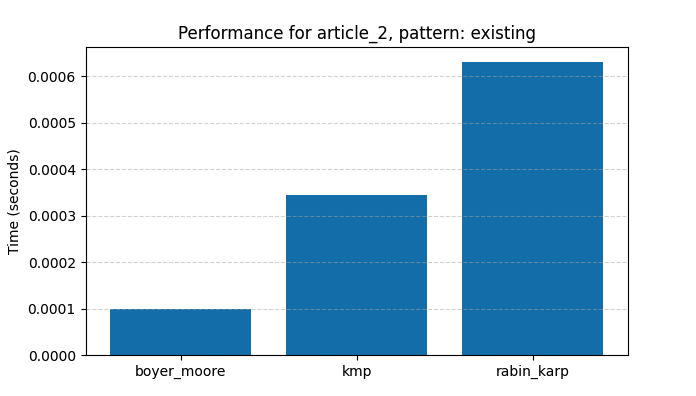
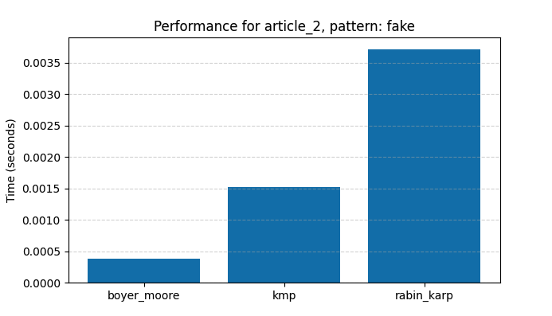

# Порівняння алгоритмів пошуку підрядка: Боєра–Мура, Кнута–Морріса–Пратта, Рабіна–Карпа  

## Огляд

У цьому проєкті порівнюється ефективність трьох алгоритмів пошуку підрядка в тексті:

- **Boyer–Moore**  
- **Knuth–Morris–Pratt (KMP)**  
- **Rabin–Karp**

Мета роботи:

1. **Емпірично порівняти** час виконання трьох алгоритмів пошуку підрядка.
2. Перевірити їх поведінку для двох випадків:
   - підрядок **існує** в тексті;
   - підрядок **відсутній у тексті**.
3. Визначити, який алгоритм є **найшвидшим**:
   - для кожної статті окремо;
   - загалом.

Для експерімента використовувалися два тексти:

- `стаття 1.txt`  
- `стаття 2.txt`

---

## Налаштування експерименту

- Мова програмування: **Python**
- Вимірювання часу: модуль **`timeit`**
- Алгоритми:
  - `boyer_moore_search`
  - `kmp_search`
  - `rabin_karp_search`
- Тексти:
  - **Стаття 1** — `src/стаття 1.txt`
  - **Стаття 2** — `src/стаття 2.txt`
- Підрядки:
  - **Існуючий**: `"алгоритмів"` — слово, що реально присутнє в обох текстах.
  - **Вигаданий**: `"test123456"` — рядок, якого немає в текстах.
- Для кожної комбінації (алгоритм × стаття × тип підрядка):
  - виконувалось по кілька сотень запусків через `timeit`;
  - у таблицях наведено **середній час** одного виклику функції (у секундах).

---

## Результати

> **Примітка:** абсолютні значення часу залежать від конфігурації комп’ютера,  
> однак співвідношення між алгоритмами стабільно зберігається.

### Стаття 1 (`стаття 1.txt`)

| Алгоритм      | Існуючий підрядок (s) | Вигаданий підрядок (s) |
|--------------|------------------------|-------------------------|
| Boyer–Moore  | 0.000015               | 0.000320                |
| KMP          | 0.000043               | 0.002161                |
| Rabin–Karp   | 0.000120               | 0.005651                |

**Спостереження:**

- Для **існуючого** підрядка Boyer–Moore найшвидший, KMP повільніший ~у 3 рази, Rabin–Karp ще повільніший.
- Для **вигаданого** підрядка різниця посилюється: Boyer–Moore завершує пошук значно швидше, тоді як KMP і Rabin–Karp витрачають помітно більше часу на повний перегляд тексту.

---

### Стаття 2 (`стаття 2.txt`)

| Алгоритм      | Існуючий підрядок (s) | Вигаданий підрядок (s) |
|--------------|------------------------|-------------------------|
| Boyer–Moore  | 0.000172               | 0.000459                |
| KMP          | 0.000656               | 0.002689                |
| Rabin–Karp   | 0.001344               | 0.008030                |

**Спостереження:**

- Результати аналогічні до першої статті:  
  Boyer–Moore стабільно лідирує, KMP посередині, Rabin–Karp найповільніший.
- Для довшого тексту **пропорції зберігаються**: Boyer–Moore дає найменший час як при успішному пошуку, так і при відсутності збігів.

---

## Аналіз результатів

### Boyer–Moore

- Найшвидший алгоритм у всіх протестованих сценаріях.
- При пошуку вигаданого підрядка дає **найменший час**, оскільки швидко відкидає невідповідні фрагменти.

### Knuth–Morris–Pratt (KMP)

- Гарантує **лінійну складність O(n + m)** й не відступає назад у тексті.
- У тестах KMP стабільно посідає **друге місце**: швидший за Rabin–Karp, але повільніший за Boyer–Moore.

### Rabin–Karp

- Працює з **хешами підрядків**, що теоретично дає перевагу при багатьох пошуках однієї й тієї ж підстроки (або кількох підстрок).
- Видно як при наявності, так і при відсутності підрядка.

---

## Висновки

1. **Для обох текстів (стаття 1 і стаття 2) найшвидшим алгоритмом виявився Boyer–Moore.**  
   Він показав найкращий час як для існуючого, так і для вигаданого підрядка.

2. **KMP посів середню позицію**:  
   - працює передбачувано та з лінійною складністю;  
   - програє Boyer–Moore за рахунок відсутності “далеких стрибків” по тексту.

3. **Rabin–Karp виявився найповільнішим** у даному експерименті,  
   оскільки вартість роботи з хешами не компенсується перевагами (ми не шукали велику кількість різних підрядків одразу).

4. Для типових завдань **пошуку одного підрядка в довгому тексті** (як у статтях)  
   **найкращим практичним вибором є алгоритм Boyer–Moore**.
